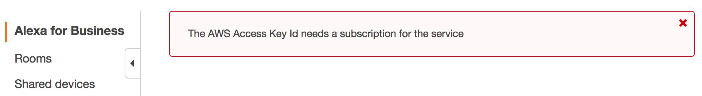
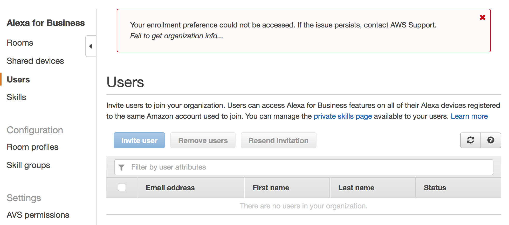

# Alexa for Business, RingCentral Meetings and Office 365 Installation Guide

## Pre-requisites:

1. [RingCentral Meetings](https://www.ringcentral.com/online-meetings/overview.html) with Room License
1. [Office 365 with Exchange Service](https://products.office.com/en-us/business/office-365-business) and User License
1. [Alexa for Business](https://aws.amazon.com/alexaforbusiness/) Account
1. [Amazon Echo or other Alexa device](https://www.amazon.com/b/?ie=UTF8&node=9818047011&ref_=fs_ods_fs_aucc_cp)

## Configuration

### Overview

The following is a list of items that will be configured as part of the configuration process:

1. Exchange Online User with License
1. Exchange Online Office Room Resource: for each room, no license necessary
1. RingCentral Rooms Calendar Integration
1. RingCentral Room (for each room)
1. A4B Enabled Skill and Skill Group
1. A4B Room
1. A4B Room Profile
1. A4B Shared Device (Echo)

### Configuration Details

Use the following instructions to get your installation working:

1. Configure RingCentral Rooms and Office 365
   * https://success.ringcentral.com/articles/RC_Knowledge_Article/8838 (PowerShell)
1. Alexa for Business - Link Office 365
   * https://docs.aws.amazon.com/a4b/latest/ag/office.html (PowerShell)
1. Alexa for Business - Create Rooms
   * https://docs.aws.amazon.com/a4b/latest/ag/manage-rooms.html
1. Alexa for Business - Add Echo Devices
   * https://docs.aws.amazon.com/a4b/latest/ag/getting-started.html
   * https://www.youtube.com/watch?v=FrunIqAcpjg

## Troubleshooting

### Alexa for Business

#### AWS Access Key Id error

When logging into Alexa for Business in the AWS console, the following error is encountered:

"The AWS Access Key Id needs a subscription for the service"

If you have a valid credit card / payment method, you may need to create a new AWS account.

#### A4B Users Error

When clicking on the A4B Users account, the following error is encountered:

Your enrollment preference could not be accessed. If the issue persists, contact AWS Support.
Fail to get organization info...

If you have a valid credit card / payment method, you may need to create a new AWS account.

## Tips

These are general tips useful when setting up a test / demo system.

### Auto-Accept Room Requests

In Exchange Admin, edit the room's "booking delegates" property and select the "Accept or decline booking requests automatically".

## Additional Useful Links

* [Reset Your Echo Device](https://www.amazon.com/gp/help/customer/display.html?nodeId=GK7P5SPCQ3MN65VR)